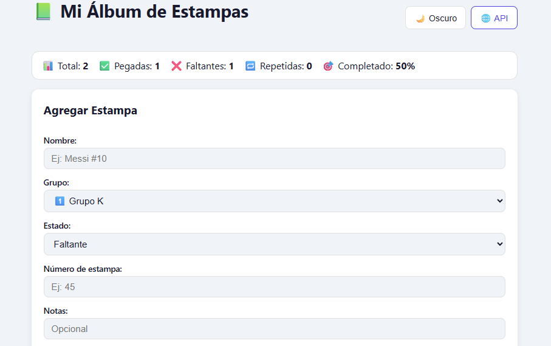
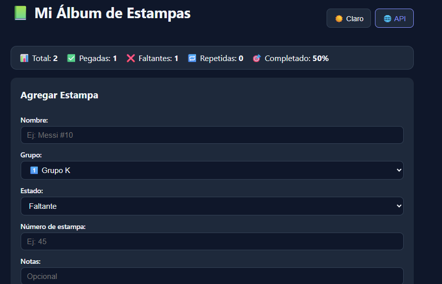
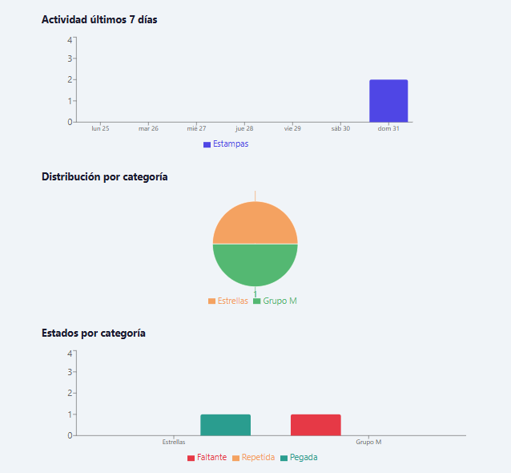
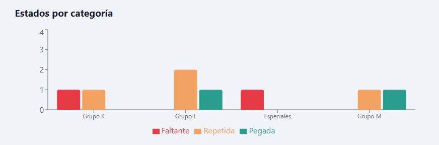
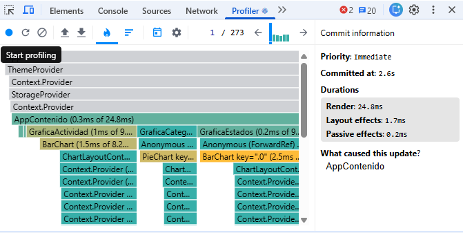
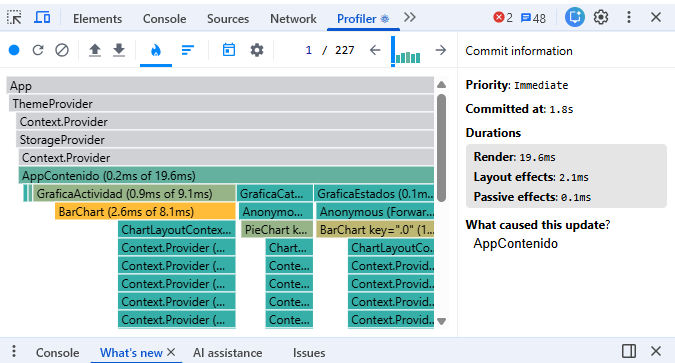

# Mi Álbum de Estampas — Mundial 2026

Aplicación full-stack para gestionar mi colección de estampas del Mundial 2026.

- **Demo**: https://web-proyecto2.vercel.app
- **Backend**: https://web-proyecto2-backend.onrender.com

## Screenshots

### Modo Claro


### Modo Oscuro


### Gráficas


## Stack tecnológico

| Tecnología | Versión | Uso |
|---|---|---|
| React | 18 | Frontend UI |
| Vite | 6 | Bundler |
| Express | 4 | Backend API |
| better-sqlite3 | 11 | Base de datos |
| Recharts | 2.12.7 | Gráficas |

## Cómo correr localmente

### Frontend
```bash
cd frontend
npm install --legacy-peer-deps
npm run dev
```

### Backend
```bash
cd backend
npm install
node src/index.js
```

## Mis primeros Items


## Mi paleta de colores

### Tema Claro
| Color | Hex | Uso | Justificación |
|---|---|---|---|
| Fondo | #f0f4f8 | Fondo general | Azul muy claro parecido al del álbum real |
| Superficie | #ffffff | Tarjetas y formulario | Blanco puro para contrastar con el fondo |
| Texto | #1a1a2e | Texto principal | Azul más oscuro, más suave que el negro para lectura |
| Acento | #4f46e5 | Botones y links | Índigo que da resalte pero sin ser intenso |
| Borde | #e0e0e0 | Bordes de tarjetas | Gris neutro que separa elementos |
| Peligro | #dc2626 | Botón archivar | Rojo de alerta, inmediatamente reconocible |

### Tema Oscuro
| Color | Hex | Uso | Justificación |
|---|---|---|---|
| Fondo | #0f172a | Fondo general | Azul muy oscuro que no es negro puro |
| Superficie | #1e293b | Tarjetas y formulario | Capa más clara para crear profundidad visual |
| Texto | #f1f5f9 | Texto principal | Blanco suave, menos contraste que el blanco puro |
| Acento | #818cf8 | Botones y links | Índigo más claro para mantener legibilidad |
| Borde | #334155 | Bordes de tarjetas | Azul grisáceo que separa sin romper armonía |
| Peligro | #f87171 | Botón archivar | Rojo claro que funciona sobre fondos oscuros |

## Mi gráfica original


La tercera gráfica muestra los estados de las estampas (faltante, repetida, pegada)
agrupados por categoría usando un BarChart agrupado. La elegí porque de un vistazo
puedo ver en qué grupos del álbum me faltan más estampas y dónde tengo más repetidas,
que es la información más útil para saber con quién intercambiar.

## Mis 3 decisiones técnicas

1. **Estructura del reducer**: organicé las acciones separando las que modifican
la lista (AGREGAR, ELIMINAR, CAMBIAR_ESTADO) de las que modifican los filtros
(FILTRAR, LIMPIAR_FILTROS) para que sea fácil encontrar cada caso.

2. **Acción más difícil**: REGISTRAR_ACTIVIDAD, porque debía actualizar solo
el campo fechaActividad del item correcto sin mutar el estado anterior,
usando map() para crear un nuevo array.

3. **Gráfica más compleja**: GraficaEstados, porque transforma los datos dos veces:
primero agrupa por categoría y luego cuenta por estado dentro de cada grupo,
generando el formato que necesita el BarChart agrupado.

## Profiler — Optimización con useMemo

### Antes

AppContenido tardó 24.8ms. Todos los componentes se re-renderizaron
al escribir en el buscador.

### Después

AppContenido bajó a 19.6ms. useMemo evita recalcular la lista filtrada
y las estadísticas en cada render, reduciendo el trabajo del componente principal.

## Hooks implementados

| Hook | Archivo | Qué hace |
|---|---|---|
| useLocalStorage | src/hooks/useLocalStorage.js | Sincroniza estado con localStorage |
| useFetch | src/hooks/useFetch.js | Fetch con data/cargando/error y AbortController |
| useAtajoTeclado | src/hooks/useAtajoTeclado.js | Registra atajos de teclado con cleanup |
| useProgresoAlbum | src/hooks/useProgresoAlbum.js | Calcula progreso y estadísticas del álbum |

## Sobre mí

- **Nombre**: Diego Alejandro Quan Castillo
- **Carnet**: 24336
- **Semestre**: Ciclo 5, 2026

**Reflexión**: Antes de este proyecto no entendía para qué servían los hooks más
allá de useState. Ahora entiendo cómo useReducer enfoca el estado,
cómo useContext evita el errores y cómo los custom hooks hacen
el código reutilizable y más fácil de mantener, también fue de gran ayuda aprender
a hacer el deploy del backend y el frontend para futuros proyectos.
