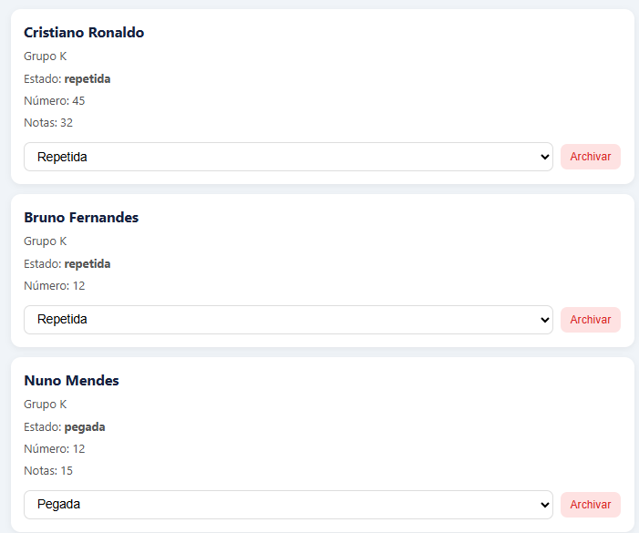

# Mi Álbum de Estampas — Mundial 2026

Aplicación para gestionar mi colección de estampas del Mundial 2026.

## Stack
- Frontend: React 18 + Vite
- Backend: Node.js + Express
- Base de datos: SQLite (better-sqlite3)

## Cómo correr el proyecto

### Frontend
```bash
cd frontend
npm install
npm run dev
```

### Backend
```bash
cd backend
npm install
node src/index.js
```

## Mis primeros Items



